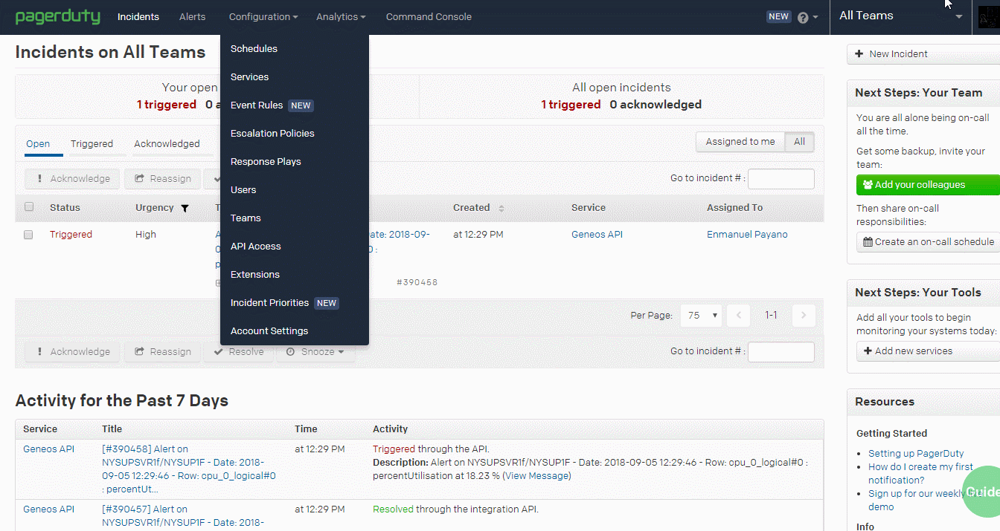
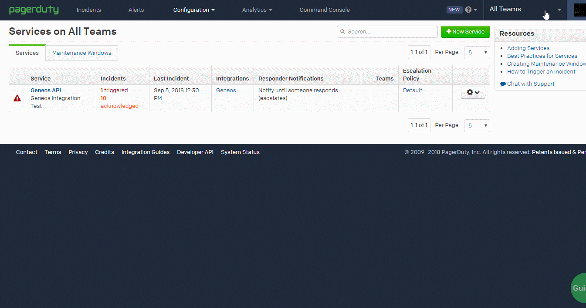
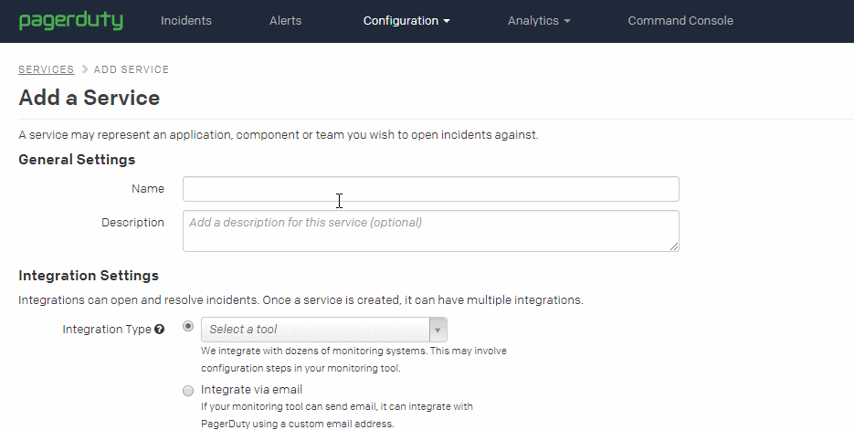
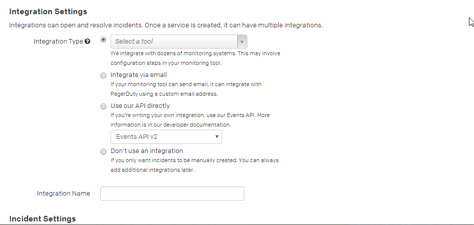
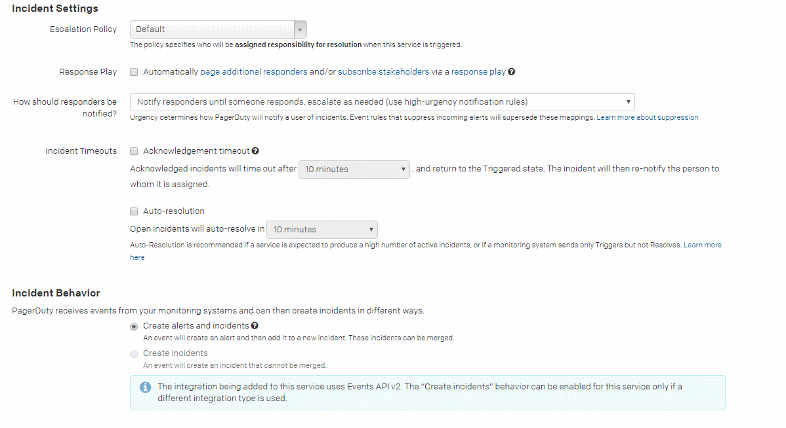
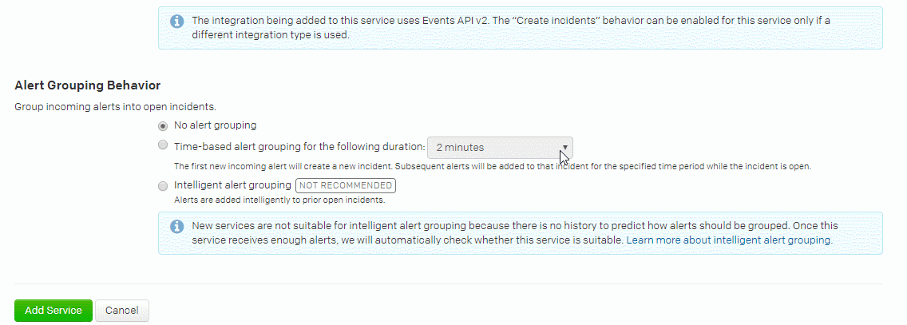
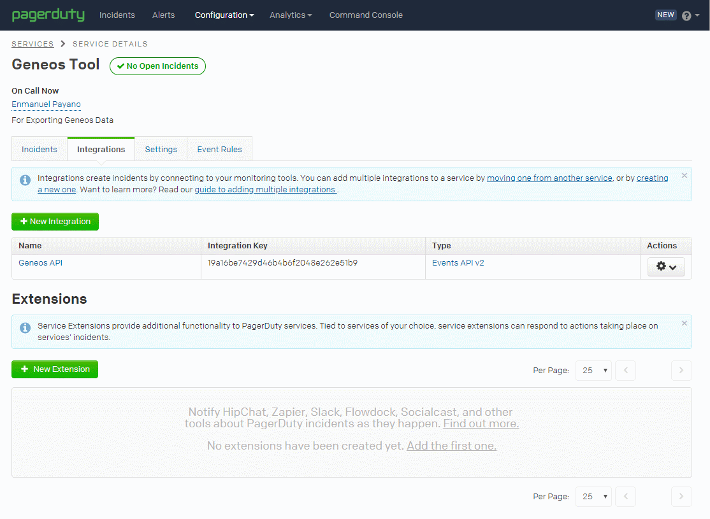
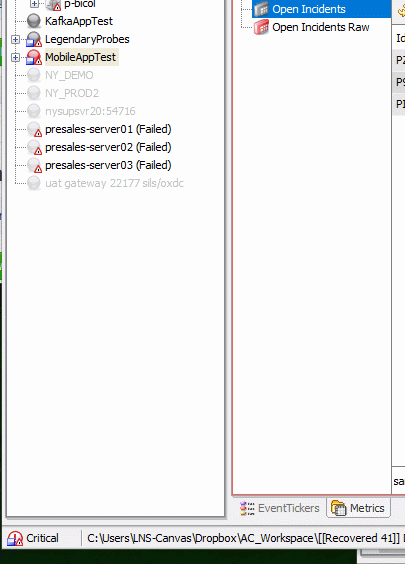
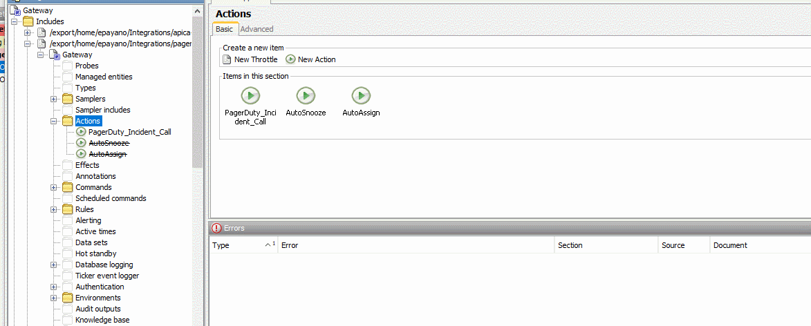
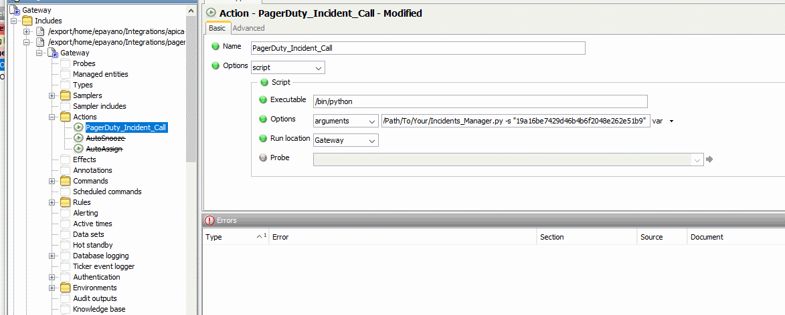

# PagerDuty Integration
ITRS &copy; Integration for PagerDuty service. This script allows you to view, create, acknowledge, resolve, and close PagerDuty incidents via the Geneos environment. This script can be configured by a set of environment variables or command line options (possibly both).  Below are requirements, installation process, and command examples for particular filtered and non-filtered outputs.

### Overview
> "PagerDuty is a SaaS-based platform used for agile incident management, not a monitoring system. PagerDuty is used as an add-on to trigger the right actions to all the data from your existing monitoring tools. PagerDuty provides sophisticated event management as well as infrastructure health visualizations to identify patterns and trends, but leaves finding problems with your systems to your existing monitoring tools." [reference](https://www.pagerduty.com/faq/)

With that being said, Geneos comes into play as an eloquent monitoring tool with PagerDuty. This include file lets you automate or manually manage your incidents through the Gateway and Active Console.

### Requirements

##### Python

You must have python 2.7 or higher installed:

`$ python -V`

This script does depend on the requests module:

`$ pip install requests`

##### PagerDuty account

To get an Integration Key, following

+ Step 1 - In your PagerDuty account, go to Configuration > Services:

+ Step 2 - Click on “New Service”, it should redirect to a configuration page:

+ Step 3 - On this page, you will need to configure the following settings for the Geneos Integration.

  + A - Fill out the General Settings to best fit your environment:

  

  + B - Then fill out the necessary information for the Integrations:

  

  + C - For Incident Settings and Behavior, make sure that “Create alerts and Incidents” is checked off:

  

  + D - For Alert Grouping Behavior, you can configure to your preference. Once done with these settings, please click on “Add Service”:

  

  + E - After adding the service, you should be forwarded to a page displaying your Integration Key. Copy this value for later use:

  

##### Geneos Framework (4.0 or higher)

A Geneos For this to properly operate for current build and future:

You may need to FTP the script. Just be sure to have the script somewhere that is accessible on the server for your Gateway to execute.

  + Step 1 - Right click on the desired gateway for your script, and click on “Configure”:

  

  + Step 2 – Create an action, then configure your path to the script. Here you can supply PagerDuty’s “Integration Key” as a command-line option.

  

  + Step 3 – Finally apply it to a rule where you would like to execute the integration from.

  
